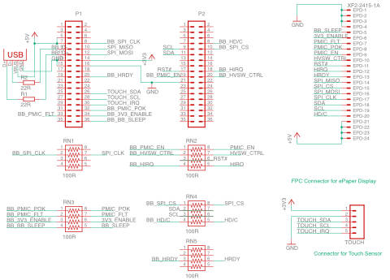
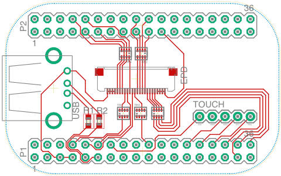

# Introduction
This is a documentation on how to use a [PocketBeagle](http://beagleboard.org/pocket) board to drive a [PlasticLogic](http://www.plasticlogic.com) ePaper display. 
I implemented a wearable prototype based on the 4.9" Lectum Display and started with the PlasticLogic [Ruddock 2](http://www.plasticlogic.com/products/evaluation-kits/kits-on-epson-platform/kits-4-9-inch-display/#1503061380699-f800df99-5e01) evaluation board. 
However, since my prototype was designed to be a wearable device, I had to move to a smaller form factor. 
As the platform is quite general-purpose, I share the information such that you can build your own one. 


# Prerequisites
For this tutorial I used the following hardware:
- PocketBeagle board ([link](http://beagleboard.org/pocket))
- 16Gb microSD-card (everything with 4Gb or more should do fine)
- PlasticLogic Hummingbird Z7.2 EPD Driver Board (C_HBZ7 / 301015) ([link](http://www.plasticlogic.com/products/evaluation-kits/kits-on-epson-platform/kits-4-9-inch-display/#1503061380699-f800df99-5e01))
- PlasticLogic 4.9" Lectum ePaper Display ([link](https://www.plasticlogic.com/products/displays/displays-with-epson/4-9-inch-display/))

This tutorial should work with all Epson S1D13541 EPD controller-based displays that are powered using the Hummingbird Z7.2 controller and connected using the 24-pin FPC connector. If in doubt, ask PlasticLogic first.  

# The Board
## Schematics 

[cape.sch](./resources/cape.sch)

[](./img/schematics.pdf)

## Board

[cape.brd](./resources/cape.brd)

[](./img/board.pdf)

I had my boards being manufactured by [Aisler](https://aisler.net). 

## BOM

| Part | Digikey Order Number |
| ---- | --- |
| XF2M-2415-1A  |  OR721CT-ND |
| USB			|  ED2989-ND  |
| R1, R2		|  RHM22DCT-ND|
| RNx			| 741X083101JPCT-ND|

# Preparing the PocketBeagle

First of all, you need to get you PocketBeagle running by flashing Linux onto a microSD card. 
Download the latest Debian image from the [beagleboard.org](http://beagleboard.org/latest-images) website. As the PocketBeagle does not have video output, we'll use the IoT-version without graphical desktop.
At the time of writing of this tutorial, the latest version was "Debian 9.5 2018-10-07 4GB SD IoT"

To flash the image, I use [Etcher](https://www.balena.io/etcher/). Just select the image and flash it onto your microSD card (all data on that card will be lost!). 

Once the OS is flashed, insert the microSD card into your PocketBeagle and connect it to your computer. On my Mac, it is reachable through IPs 192.168.6.2 or 192.168.7.2

SSH into your PocketBeagle using 
```ssh debian@192.168.7.2```
The default password is `temppwd' which you should change obviously.
 
### Optional: Re-partition the microSD-card to use its full capacity
The beagleboard images are set up to fit exactly on a 4Gb card. If you flash it onto a larger card, the remaining space will be left unused. 
If you want to use the additional space, you need to re-partition the card accordingly. See [this guide](https://elinux.org/Beagleboard:Expanding_File_System_Partition_On_A_microSD) for more info. 

### Install the required packages
```sudo apt-get install libfreetype6 ```

## Setting the pins to their intended use
The pins on the PocketBeagle can serve multiple purposes, from general purpose I/O to specific hardware capabilities. Their functionality is controlled through the config-pin command. For example, the Pin P1_08, which we will use for the SPI_CLK signal can have the following functionality:

```
debian@beaglebone:~$ config-pin -i P1_08
Pin name: P1_08
Function if no cape loaded: spi_sclk
Function if cape loaded: default gpio gpio_pu gpio_pd gpio_input spi_sclk uart i2c pwm pru_uart
Function information: spi0_sclk default gpio0_2 gpio0_2 gpio0_2 gpio0_2 spi0_sclk uart2_rxd i2c2_sda ehrpwm0a pru_uart
Kernel GPIO id: 2
PRU GPIO id: 34
```


To set the pins to their correct purpose automatically at boot time, we will use the same procedure as described [here](https://gist.github.com/pdp7/d4770a6ba17e666848796bf5cfd0caee)

## Configure pins at boot time

Create a file `/usr/bin/epdc-enable-pins.sh`

**sudo nano /usr/bin/epdc-enable-pins.sh**
```bash
#!/bin/bash
#EPDC Connector
config-pin P1_08 spi_sclk	#SPI_CLK
config-pin P1_10 spi		#SPI_MISO
config-pin P1_12 spi		#SPI_MOSI
config-pin P1_20 in			#HRDY
config-pin p1_32 in			#PMIC_POK
config-pin p1_33 in			#PMIC_FLT
config-pin p1_34 hi			#3V3_ENABLE
config-pin p1_36 lo			#BB_SLEEP

config-pin p2_08 hi			#HD/C
config-pin p2_09 i2c		#SCL
config-pin p2_10 hi			#SPI_CS
config-pin p2_11 i2c		#SDA
config-pin p2_17 hi			#RST
config-pin p2_18 hi+		#HIRQ
config-pin p2_19 lo			#PMIC_EN
config-pin p2_20 lo			#HVSW_CTRL

```

**sudo chmod 755 /usr/bin/epdc-enable-pins.sh**

Create a system service file `/lib/systemd/system/enable-epdc-pins.service`

**sudo nano /lib/systemd/system/epdc-enable-pins.service**
```
[Unit]
Description=Enable pins required for the ePaper display
After=generic-board-startup.service

[Service]
Type=simple
ExecStart=/usr/bin/epdc-enable-pins.sh

[Install]
WantedBy=multi-user.target
```
### Enable the new systemd service
**sudo systemctl daemon-reload**
**sudo systemctl enable enable-epdc-pins.service**
```
Created symlink /etc/systemd/system/multi-user.target.wants/epdc-enable-pins.service → /lib/systemd/system/epdc-enable-pins.service.
```

### Reboot and test
**sudo systemctl status enable-epdc-pins.service**
```
● epdc-enable-pins.service - Enable pins required for the ePaper display
   Loaded: loaded (/lib/systemd/system/epdc-enable-pins.service; enabled; vendor preset: enabled)
   Active: inactive (dead) since Sun 2018-10-07 16:41:02 UTC; 36s ago
  Process: 1531 ExecStart=/usr/bin/epdc-enable-pins.sh (code=exited, status=0/SUCCESS)
 Main PID: 1531 (code=exited, status=0/SUCCESS)

Oct 07 16:41:00 beaglebone systemd[1]: Started Enable pins required for the ePaper display.
```

# Copy the necessary configuration files
The epdc-app looks for the configuration files in the ```/boot/uboot```-folder. Depending on your configuration it might be more useful to place the files somewhere else and use softlinks (`ln -s`).
I copied the S049_T1.1 folder from this [Plastic Logic Repository)[https://github.com/plasticlogic/pl-bb-sd-card] and the following configuration files to /boot/uboot/: 


**`/boot/uboot/config.txt`**
```
display_type S049_T1.1

```

**`/boot/uboot/S049_T1.1/epdc.config`**
```
[version]
name = CONFIG_S049_T1.1

[display]
nvm = S1D13541
nvm_format = S1D13541
controller = S1D13541
temp_mode = MANUAL
instruction_code_file = "/boot/uboot/S049_T1.1/bin/Ecode.bin"
default_vcom = 4000
default_temp = 23
default_waveform = "/boot/uboot/S049_T1.1/display/waveform.bin"

[general]
driver_board = CHIFFCHAFF
control_system = BEAGLEBONE_BLACK
spi_port = 1
epdc_spi_port = 1
nvm_spi_port = 1
DISPLAY_SCRAMBLE_CONFIG	= 96

[vcom]
dac_x1				= 127	;   /* first DAC register value (25% of full scale) */
dac_y1				= 4172	;   /* corresponding first voltage in mV */
dac_x2				= 382	;   /* second DAC register value (75% of full scale) */
dac_y2				= 12490	;   /* corresponding second voltage in mV */
vgpos_mv 			= 25080	;   /* VGPOS in mV */
vgneg_mv 			=-32300	;   /* VGNEG in mV */
swing_ideal 	= 56886

[hv_hardware]
hv_config_vgl = -32300
hv_config_vgh =  25080
hv_config_vsh =  15000
vcom_driver = NULL
vcom_config = TPS65185
hv_driver = GPIO
hv_config = TPS65185
hv_timing = TPS65185
vcom_switch = GPIO
TOFFSET_VGL_ON	=	8
TOFFSET_VSL_ON	=	2
TOFFSET_VSH_ON	=	11
TOFFSET_VGH_ON	=	3
TOFFSET_VGH_OFF	=	0
TOFFSET_VSH_OFF	=	0
TOFFSET_VSL_OFF	=	0
TOFFSET_VGL_OFF	=	0
```

# Install the EPDC-App compiled for the PocketBeagle
Check the [pl-bb-epd companion repository](https://github.com/florianheller/pl-bb-epd/) for the latest version.
You can download a pre-compiled version that works on the Debian 9.5 image mentioned at the beginning of this document. [epdc-app](./resources/epdc-app)
## Test it

```
debian@beaglebone:~$ ./epdc-app -start_epdc 0 1
configparser     DISPLAYTYPE: S049_T1.1
configparser     version - CONFIG_S049_T1.1

configparser     Interface: SPI
s1d13541_controller Using HDC GPIO
configparser     No register settings specified in the configuration file.
main             load_nvm_content?: 0
s1d135xx         Product code: 0x0053
s1d13541_controller Ready 360x240
generic_epdc     epdc_init: stat: 0
tps65185         Version: 1.2.5
tps65185         tps65185_apply_timings - not yet implemented
nvm              Used nvm format (1) does not support load waveform from nvm.
generic_epdc     NVM_FORMAT_S1D13541 does not support Wf loading from NVM
generic_epdc     Loading wflib: /boot/uboot/S049_T1.1/display/waveform.bin
generic_epdc     epdc_init: stat: 0
generic_epdc     Setting vcom: 4000
vcom             input: 4000, scaled: 4035, DAC reg: 0x7B
tps65185         calculate: 4000, 123
generic_epdc     epdc_init: stat: 0
generic_epdc     do_clear_update: stat: 0
generic_epdc     switch_hvs_on: stat: 0
generic_epdc     do_clear_update: stat: 0
generic_epdc     do_clear_update: stat: 0
generic_epdc     do_clear_update: stat: 0
generic_epdc     switch_hvs_off: stat: 0
generic_epdc     do_clear_update: stat: 0
```

## Update an image on the display
```
debian@beaglebone:~$ ./epdc-app -update_image /boot/uboot/S049_T1.1/img/dresden.png
configparser     DISPLAYTYPE: S049_T1.1
configparser     version - CONFIG_S049_T1.1

configparser     Interface: SPI
s1d13541_controller Using HDC GPIO
configparser     No register settings specified in the configuration file.
main             path: /boot/uboot/S049_T1.1/img/dresden.png
main             wfID: 1
main             updateMode: 0
main             updateCount: 1
main             waitTime: 0
main             vcomSwitch: 1
s1d135xx         BW
utils            filename /boot/uboot/S049_T1.1/img/dresden.png
utils            width 720, height 120, bit_depth 8, channels 1
generic_epdc     generic_update: stat: 0
generic_epdc     generic_update: stat: 0
generic_epdc     switch_hvs_on: stat: 0
generic_epdc     generic_update: stat: 0
generic_epdc     generic_update: stat: 0
generic_epdc     switch_hvs_off: stat: 0
generic_epdc     generic_update: stat: 0
```


# Legal & Acknowledgements
I am not associated to PlasticLogic in any way. I just use their hardware and received very good support while working on the adaptation of the EPD driver software. 

This tutorial is provided `as is'. I used the described setup and it worked fine, but I do not take any responsibility for potential problems that might arise when following this tutorial. 

